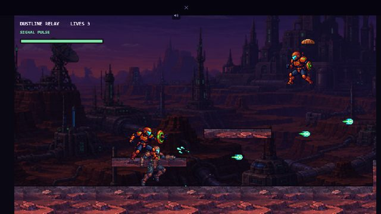
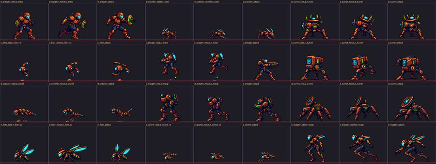
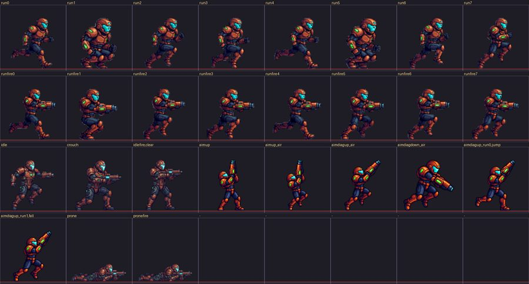
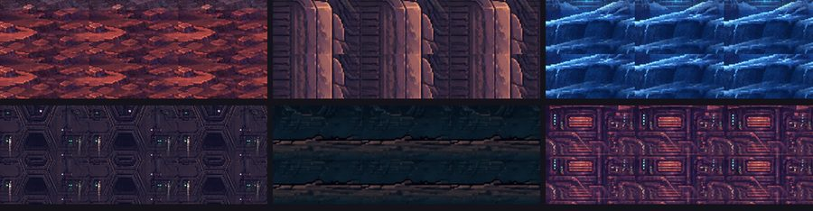
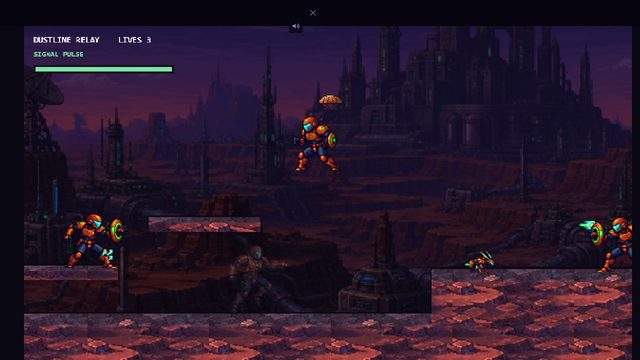
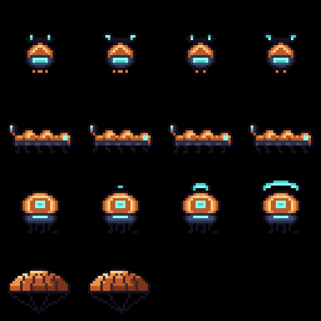
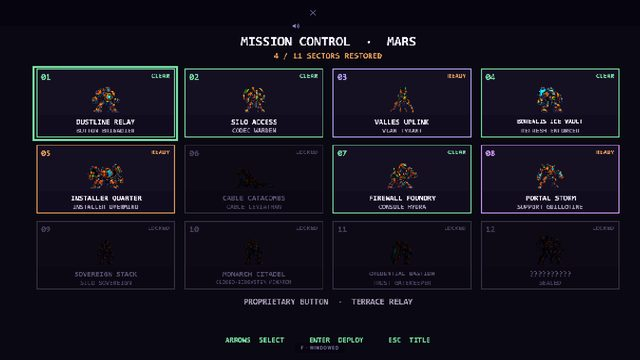

# Mars: Signal Siege — production report

Replaces **RELAY RUN** as the Mars easter egg with a native Phaser
implementation of **MARS: SIGNAL SIEGE**, ported from the standalone
`Mars_Signal_Siege_v0.7.html` prototype.

The prototype is treated as the gameplay specification, not as the production
architecture: nothing is iframed, no second `requestAnimationFrame` runs, and
nothing is composited into a single canvas texture. Every actor is a real
Phaser Sprite in a real display list, driven by Phaser's own loop, animations,
camera, input and sound manager.

---

## 1. MCP usage

All four MCP servers were verified callable before any work began, and all four
did production work. Stable Audio failed its first health check (HTTP 402, no
credits); that was reported and the account was topped up before proceeding.

### Aseprite MCP

Used to author the enemy types the masters did not contain. The inherited art
covers twelve ground enemies across four sector liveries and **no fliers at
all**, so the campaign had nothing in the air and nothing that visibly charged
before it fired.

| Master (editable) | Canvas | Frames | Tag | Role |
|---|---|---|---|---|
| `uplink-wasp.aseprite` | 16×16 | 4 | `hover` | Hovering gun-drone: counter-rotating blades, cyan sensor lens, stub thrusters that flicker across the cycle |
| `conduit-crawler.aseprite` | 26×13 | 4 | `crawl` | Low armoured mite: three carapace domes, wedge head with a cyan eye band, raised tail barb, six legs |
| `beacon-sentinel.aseprite` | 20×22 | 4 | `charge` | Floating shield node whose arc opens outward over four frames — the telegraph the player reads |
| `drop-canopy.aseprite` | 26×18 | 2 | `drift` | Paratroop canopy: domed skirt, gore seams, four shroud lines converging on the harness |

Exports: `Game art files/Mars Signal Siege/exports/{uplink-wasp,conduit-crawler,beacon-sentinel,drop-canopy}.{png,json}`.

**All four were redrawn or added in the second pass.** The originals were flat
purple with stick legs — the only actors on screen that did not share the sector
palette, which is exactly how they read in play ("a purple low to the ground
blob"). The maps now live in `scripts/art/mars_authored.py` alongside the shared
ramp and are pushed into Aseprite from there, so a redraw is a diff to a
readable source rather than a hand re-plot. The canopy's dome is generated from
a half-width profile rather than plotted by hand: a parachute is read almost
entirely from the curve of its skirt, and the hand-drawn one came out looking
like a table.

Authoring notes:
- Frames 2–4 of the crawler and sentinel were drawn as **diffs** over a copied
  previous frame (16–28 pixels each) rather than as full redraws, because only
  the legs and the shield arc move.
- The first crawler generator produced only two distinct leg poses (frames 1/3
  and 2/4 were identical). That was found by inspecting the exported sheet and
  fixed by rewriting the leg table to four opposed phases.
- These three sheets **bypass** the un-matte/despeckle pipeline. Their detached
  parts (rotor blur, thruster flame, shield arc) are deliberate, so the sheet
  is marked `allowDetached` for the atlas checker.

Total non-boss enemy types: **15** (12 inherited liveries + 3 authored).

### FamiStudio MCP

Used for the tonal half of the sound design — where chip voicing is the right
answer rather than a fallback. A UI confirm wants a clean interval, not a
sample.

- Project: `Game audio files/Mars Signal Siege/famistudio/mars-sfx-chip.txt`
  (FamiStudio 4.5.3 text format, 16 songs, four channels, instruments
  `PulseLead`, `PulseCounter`, `TriangleBass`, `NoiseDrums`).
- Renders: `Game audio files/Mars Signal Siege/famistudio/render/*.wav` (16 files).
- Songs: `ui_move`, `ui_confirm`, `ui_deny`, `pause`, `resume`, `pickup`,
  `jump`, `deploy`, `fire_pulse`, `fire_stream`, `fire_spread`, `fire_wave`,
  `fire_guided`, `enemy_fire`, `clear_sting`, `gameover_sting`.

The project was created through `famistudio_create_project` and the first song
rendered through `famistudio_export_audio`. The remaining 15 renders were driven
through the same `FamiStudio.exe … wav-export` CLI in a loop, because the MCP's
export takes **one song per call** (passing a list fails inside FamiStudio's own
argument parser with `FormatException`).

### Stable Audio MCP

Used for the broadband, textured effects a 2A03 cannot produce — destruction,
impacts, the cryo freeze, the thermal launcher, boots on deck.

Eleven generations, saved to `Game audio files/Mars Signal Siege/sfx-masters/stable-audio/`:
`enemyDown`, `freeze`, `bossDown`, `bossHit`, `playerHit`, `death`, `shield`,
`land`, `fire5_thermal`, `enemyHit`, `fire7_barrier`.

Prompting notes worth keeping:
- Every prompt opens with **"Sound effect only, no music"** and closes with
  **"completely dry, no reverb, hard transient at time zero"**. Without the
  transient instruction the model pads the attack and the effect arrives late.
- One prompt (`bossHit`, phrased as armour struck by a projectile) was refused
  by content moderation. Rephrasing it as industrial foley — *"a thick steel
  plate struck once by a heavy hammer in a machine shop"* — produced the same
  sound and passed. Combat phrasing is the trigger, not the sound.
- Output is padded to the requested duration and peaks at exactly 1.0, so every
  clip is trimmed, enveloped and levelled downstream (§4).

Nothing generated is melodically derivative of the mechanics-reference ROM;
these are non-pitched effects and short chip stingers written from scratch.

### Phaser MCP

Used as an independent design standard rather than as a code generator: its
building-block library targets the agent's own sandbox engine model, which does
not map onto this repo's Phaser 4 + Astro architecture, so no block code was
reused.

What it was genuinely used for:
1. **Health check** — `phaser_game_agent_hello` confirmed the server was
   authenticated and callable before work began.
2. **Asset recovery** — the v0.7 prototype loaded 65 of its assets from the
   Phaser Game Agent's CDN (`gameblocks.nyc3.digitaloceanspaces.com`), including
   *all eight player weapon projectiles* and every Rook key pose. Those are not
   in the local Mars folder. All 65 were retrieved into
   `Game art files/Mars Signal Siege/source-cdn/` with a provenance manifest
   (`_cdn_manifest.json`) so the site self-hosts them and has no runtime
   dependency on that host.
3. **Design review** — `system.weapon.bullet-patterns` was read as an
   independent specification for pooled projectile fire. It confirmed two
   invariants this implementation already held (the fire controller is handed a
   muzzle position and never knows the firer; tap-spam cannot beat the cooldown)
   and caught one real gap: a recycled player shot did not reset every field.
   Fixed in `systems/ProjectileSystem.ts`.

---

## 2. Art pipeline

`scripts/build-mars-art.py` (`pnpm mars:art`) → `public/eggs/mars-signal-siege/art/`
Graded by `scripts/check-mars-sprite-atlases.py`.

### Defects found in the masters, and what was done

| Defect | Where | Fix |
|---|---|---|
| **Fractional cell height** | The four enemy sheets and the enemy projectile sheet are 1536×1024 cut 3×3 and 4×3 — 341.33 px per row. Every row after the first sampled a slice of its neighbour. | Re-cut on exact float boundaries, then re-seated in a uniform grid. |
| **Atlas clipping** | Enemy-group row 1 subjects ran into the bottom wall; row 2 into the top. Projectile row 2 subjects ran off both side walls. | Trim to true opaque bounds and re-seat with a guaranteed 3 px gutter. |
| **White matte halo** | Masters were flattened onto white before the alpha was cut, leaving a pale rim. | Un-matte by recovering `F` from `C = a·F + (1−a)·255`, which removes the halo instead of eroding the sprite. |
| **Never fully opaque** | Several sheets had a maximum alpha of 253–254, i.e. the whole subject was slightly see-through and backgrounds ghosted through. | Alpha hardened to a clean 0/255 with a short ramp. |
| **Stray fragments** | Detached crumbs from the original atlas cut — Rook's idle pose carried a 72 px blob beside his shoulder that would have followed him around as a floating speck. | Connected-component despeckle, run **twice**: once at master resolution and again after resampling, because a crumb that is 300 px on a 512 px master is a dozen pixels on the game's grid. |
| **Painterly source at game scale** | Cells are 341–512 px; the game draws enemies at 42–62 px. Drawing those directly is what makes the art mush. | Lanczos downsample to the game's native pixel grid plus a light unsharp pass, so Phaser integer-scales true 1× pixel art with nearest-neighbour. |

### Shipped atlases

| Sheet | Size | Grid | Cell | Bytes |
|---|---|---|---|---|
| `rook/rook.png` | 768×384 | 8×4 | 96×96 | 170 KB |
| `enemies/enemies.png` | 720×320 | 9×4 | 80×80 | 163 KB |
| `enemies/new-enemies.png` | 128×96 | 4×3 | 32×32 | 0.9 KB |
| `bosses/bosses.png` | 1344×2304 | 7×12 | 192×192 | 1.88 MB |
| `projectiles/projectiles.png` | 576×240 | 12×5 | 48×48 | 75 KB |
| 6 × `backgrounds/*.png` | 640×360 | — | — | 2.03 MB |
| 5 × `ui/*.png` | — | — | — | 1.03 MB |

**Total production art: 5.23 MB**, from 45 MB of masters.

Rook geometry: cell **96×96**, ground baseline **93**, pivot column **48**,
drawn height **74**.

### Animation tags

Rook (28 live frames): `run` ×8, `runfire` ×8, `idle`, `jump`, `fall`, `clear`,
`aimup`, `aimup_air`, `aimdiagup_air`, `aimdiagdown_air`, `aimdiagup_run` ×2,
`prone`, `pronefire`.

Bosses, ×12: `idle` (2), `walk` (4), `air`, `wind`, `fire`, `recover` (2) — 7
cells per boss, 84 total.

Enemies: `{b,c,d,e}_{trooper,mite,turret}_{idle,move,attack,walk}` — 36 cells.
Authored: `wasp_hover`, `crawler_crawl`, `sentinel_charge` — 4 frames each.

### Muzzle sockets

The prototype spawned shots from six hand-tuned offsets and fell back to the
collision-box centre for every pose it did not cover — which is why bolts left
Rook's stomach when he fired upward or while prone.

Every one of the 28 live Rook frames now carries a muzzle position **measured
off its own artwork** by `muzzle_socket()` in the art build, using a per-pose
rule (`forward`, `up`, `diag_up`, `diag_down`, `prone`). The game reads the
socket for the frame it is drawing at the instant of firing.

Sample, cell-local (x, y):

| Pose | Frame | Socket | Sense check |
|---|---|---|---|
| `idle` | 16 | (67, 58) | chest height, forward |
| `run` phase 0 | 0 | (77, 48) | forward, slightly raised |
| `aimup` | 20 | (49.5, 19) | centred, above the helmet |
| `aimdiagdown_air` | 23 | (82, 58) | forward and low |
| `prone` | 26 | (86, 79) | far forward, near the floor |

`test:mars` asserts the aim-up socket is above the forward socket and the prone
socket below it, so a regression that flattens the table fails the build.

---

## 3. Levels

`src/games/mars-signal-siege/levels.ts` is free of Phaser and of anything
browser-only, so `scripts/check-mars-levels.mjs` imports **the real generator**
rather than a copy of it.

Three additions over v0.7:

1. **A repair pass.** v0.7 emitted platforms and then *measured* whether the
   boss was reachable, reporting failures into a QA readout nobody blocked on.
   Unreachable surfaces are now bridged and overlaps trimmed before the stage is
   returned, and `audit()` must come back clean.
2. **Determinism.** Enemy placement used `Math.random()`, so a QA failure could
   not be reproduced. A seeded PRNG keyed on the mission index replaces it.
3. **Spawn safety.** An enemy slot is rejected if its body box intersects any
   surface other than the one it stands on — several troopers were otherwise
   placed waist-deep in the upper ledges that shared their span.

The audit found and forced fixes for two real classes of defect during
development: the bridge repair was **dropping the boss arena** on the two
steepest missions (10 and 12 had 6 and 5 platforms left, and no route to the
boss), and 10 of 12 missions had enemies embedded in geometry.

Final state — all twelve clean:

```
mission  kind        plat  reach  enemy  maxGap  maxRise  status
     1  horizontal   15    15     11     142      54      ok
     2  horizontal   16    16     13     142      54      ok
     3  vertical     37    37     20     152      73      ok
     4  horizontal   15    15     12     145      54      ok
     5  horizontal   25    25     20     142      55      ok
     6  horizontal   19    19     14     142      64      ok
     7  horizontal   15    15     11     142      54      ok
     8  horizontal   18    18     13     142      54      ok
     9  horizontal   24    24     20     150      55      ok
    10  horizontal   19    19     13     145      65      ok
    11  horizontal   25    25     20     142      64      ok
    12  horizontal   13    13      8     142      55      ok
```

Six environment families across twelve missions (dustline, uplink, ice vault,
hive city, catacombs, foundry). Mission 3 (Valles Uplink) is the vertical
ascent up the toxic coolant cascade.

---

## 4. Audio

### Music — remastered, not merely re-encoded

`scripts/build-mars-audio.py` (`pnpm mars:audio`).

The thirteen compositions are finished works, but they were rendered as
standalone pieces rather than as game cues, so three things were wrong:

1. **Five of the eight looping tracks faded to silence at the end** — looping
   those puts a hole in the music every time round. Each is trimmed back to
   where the arrangement is still at full energy, then equal-power crossfaded
   into its own opening (44 ms).
2. **Six peaked at exactly 1.0**, i.e. already clipped. Gain is set from RMS
   and the peak brought down under a tanh knee rather than hard-clipped.
3. **Loudness spanned 7.8 dB.** Mission cues sit at −16.5 dBFS, the boss cue at
   −15.5 — audibly stronger, not a jump in level.

| Cue | Source | Loops | Trimmed | Length | dBFS | Peak | OGG |
|---|---|---|---|---|---|---|---|
| `title` | `Mars_title.wav` | no | — | 5.0 s | −17.9 | 0.95 | 74 KB |
| `introduction` | `Mars_introduction.wav` | yes | 2.76 s | 57.2 s | −16.5 | 0.78 | 637 KB |
| `assault` | `Mars_assault_hangar.wav` | yes | 0.84 s | 59.2 s | −16.5 | 0.95 | 836 KB |
| `bases` | `Mars_bases.wav` | yes | 0.00 s | 55.0 s | −16.5 | 0.95 | 808 KB |
| `toxic` | `Mars_toxic_waterfall.wav` | yes | 2.38 s | 57.6 s | −16.5 | 0.92 | 763 KB |
| `ice` | `Mars_ice_field.wav` | yes | 0.02 s | 60.0 s | −16.5 | 0.81 | 913 KB |
| `energy` | `Mars_energy_zone.wav` | yes | 1.84 s | 48.2 s | −16.5 | 0.51 | 625 KB |
| `lair` | `Mars_alien_lair.wav` | yes | 0.56 s | 54.4 s | −16.5 | 0.88 | 859 KB |
| `boss` | `Mars_boss.wav` | yes | 0.02 s | 45.0 s | −15.5 | 0.83 | 656 KB |
| `clear` | `Mars_area_clear.wav` | no | — | 5.0 s | −17.0 | 0.94 | 83 KB |
| `coreDown` | `Mars_alien_dead.wav` | no | — | 9.0 s | −17.0 | 0.76 | 129 KB |
| `credits` | `Mars_credits.wav` | no | — | 80.0 s | −17.0 | 0.52 | 1079 KB |
| `gameover` | `Mars_game_over.wav` | no | — | 7.0 s | −17.0 | 0.95 | 100 KB |

**92.9 MB of PCM masters → 7.38 MB OGG + 8.00 MB MP3.** All thirteen
compositions ship in full; nothing is excerpted. MP3 is carried alongside OGG
because Safari has no reliable Vorbis support, and Phaser fetches only the one
the browser reports it can play.

Masters retained at `Game audio files/Mars Signal Siege/masters/`; loop
decisions recorded in `loop-points.json`.

### Cue map

Implemented once, in `cueFor()` in `data.ts`, and used by `PlayScene` — so the
specification and the behaviour cannot drift. `check-mars-audio.mjs` asserts all
21 mappings against that same function.

| State | Cue |
|---|---|
| Title | `title` |
| Mission select / briefing | `introduction` |
| Missions 1, 5 | `assault` |
| Missions 2, 6, 9 | `bases` |
| Missions 3, 8 | `toxic` |
| Missions 4, 11 | `ice` |
| Mission 7 | `energy` |
| Missions 10, 12 | `lair` |
| Regular boss | `boss` |
| Final boss | `lair` (distinct from the shared boss theme) |
| Mission clear | `clear` |
| Final destruction | `coreDown` |
| Ending credits | `credits` |
| Game over | `gameover` |

### Sound effects — 31, split by what each tool is good at

`scripts/build-mars-sfx.py`. Every source is trimmed of generated padding,
enveloped (3 ms in / 22 ms out, so rapid retriggers do not click), and levelled
to a per-category peak: weapons 0.62, impacts 0.78, UI 0.70, stingers 0.82.

- **Stable Audio (11):** `fire4` (cryo), `fire5` (thermal), `fire7` (barrier),
  `freeze`, `shield`, `land`, `playerHit`, `death`, `enemyHit`, `enemyDown`,
  `bossHit`, `bossDown`.
- **FamiStudio (20 derived from 16 songs):** `fire0`–`fire3`, `fire6`,
  `enemyFire0/1/2` (one source, three pitch variants so the four sector
  families do not all sound alike), `jump`, `pickup`, `uiMove`, `uiConfirm`,
  `deny`, `pause`, `resume`, `respawn`, `deploy`, `clear`, `gameover`.

**Total: 386 KB (OGG + MP3).** Every category the brief enumerates is covered,
and `check-mars-audio.mjs` fails if any role has no effect behind it.

---

## 5. Website integration

| File | Change |
|---|---|
| `src/components/GameOverlays.astro` | New `#egg-mars` modal with `#egg-mars-mount`, `#egg-mars-status`, `#egg-mars-hint`. Legacy SVG card now reads `MARS: SIGNAL SIEGE`. |
| `src/scripts/eggs/runtime.ts` | `eggOpenMars` / `eggCloseMars` / `eggMarsToggleMute` / `eggMarsSetView`; `eggLaunch("catch")` routes here; Mars registered in the closer maps, the open-game list and the key-ownership guard; both functions exposed on `window` for the inline handlers. |
| `src/scripts/eggs/solar3d.ts` | Mars card: game `MARS: SIGNAL SIEGE`, kicker `Mars · signal reclamation campaign`, new brief. |
| `src/scripts/eggs/data.ts` | Legacy/accessible `SS_SCENE` fallback map updated to match. |
| `src/components/DevPanel.astro` | Route label updated. |
| `src/styles/games.css` | `#egg-mars` added to the modal, full/windowed, control-position and hint rules alongside `#egg9`. |

**The old Relay Run implementation is left in place and dormant**, as
instructed. It is not dead code that can be deleted: seven of its sprite keys
are drawn by SIGNAL JUMPER, and `#egg` is still `eggLaunch`'s fallback branch.
`test:mars` asserts it is still present, and that all eight other planets still
reach the game they always did.

### Lazy loading

`import("../../games/mars-signal-siege/index")` is the only route in, so Phaser
and the Mars code are code-split behind Mars being opened. Build output:

- `dist/_astro/mars-signal-siege.*.js` — **73.8 KB** (game code)
- `dist/_astro/phaser.esm.*.js` — 1.37 MB (shared with Polaris-Man, lazy)
- `dist/eggs/mars-signal-siege/` — 22 MB of static assets, fetched per screen

Per-screen budget: the title screen fetches the cover, logo, atlas manifest,
three UI effects and the title cue (~500 KB). Mission select streams the boss
sheet behind an already-visible grid. A mission adds only its own 340 KB
backdrop. Nothing loads before Mars is selected.

All URLs go through `withBase()`; `test:mars` asserts that only the two path
roots are written as raw strings and that all four URL helpers wrap them.

---

## 6. Independent review, and what it changed

Three reviewers were run over the finished build with no knowledge of the
implementation reasoning, each required to produce file:line evidence rather
than a verdict: one on sprite animation and projectile origins, one on website
lifecycle and leaks, one on game flow, level traversal and audio.

They were worth it. Between them they found **eight HIGH-severity defects**, of
which four would have been immediately visible to a player and three would have
made the game silent or unwinnable. Every high and medium finding below was
fixed; the reviewers' own reproductions are quoted where they matter.

### Fixed — HIGH

| # | Defect | Why it mattered |
|---|---|---|
| 1 | **Music fade tweens were attached to `PreloadScene`**, which stops itself the moment it hands over to the title. A stopped scene's TweenManager is unhooked from the update event, so every fade sat at t=0 forever. | Music was added at volume 0 and **never rose** — the game would have shipped effectively silent, with music only becoming audible after the player happened to pause once. The outgoing cue's `stop()/destroy()` lived in the same dead tween, so cues also stacked up per transition. Fades now run off the game's `POST_STEP`, which lives exactly as long as the manager does. |
| 2 | **Eleven of the thirteen cues were never loaded.** Only `title` and `introduction` were ever queued. | `playMusic` is deliberately forgiving — it returns quietly when a cue is not cached — so no mission, boss, clear or game-over music would have played and nothing would have errored. `missionAudio()` now enumerates every cue a mission can reach, and the briefing screen blocks on it. |
| 3 | **Rook froze on a run frame every time he stopped.** Phaser never clears `currentAnim` (not on `stop()`, not on `setTexture()`, only on `destroy()`), so the `currentAnim.key !== key` guard evaluated false when re-entering idle after running. | Reproduced by the reviewer against the real `Rook.ts`: `idle → run → idle` left the sprite on run frame 0. Now guarded on the pose this object last applied. |
| 4 | **`shutdown()` was never called.** Phaser's `Systems.shutdown` only *emits* `SHUTDOWN`; it does not invoke a method by that name. | All teardown was dead code. Worst consequence: `drops` grew by six slots per mission, and `spawnDrop` picked the first free slot — a sprite the display list had already destroyed — so **mission two threw a TypeError on its first weapon drop**. Now subscribed explicitly, and the per-mission state is reset in `create()`. |
| 5 | **The title screen became a dead end on every return visit.** `started` is a class field, and Phaser reuses one instance per scene class for the life of the Game. | After the first deploy, Enter did nothing forever — making the credits → title → play loop unreachable. Reset in `create()`, along with the same class of stale state in mission select and the ending. |
| 6 | **The runtime checkpoint could be written over a pit.** Landing needs only 3 px of overlap, so a grounded player can be most of a body-width past the edge, and the stored point took a further 20 px off. | The reviewer walked mission 1 and found the player lands at x≈2507 with a checkpoint at 2487 — off the platform. Respawning drops them into the gap, which respawns them at the same point: **an unwinnable loop until GAME OVER**. Present on 11 of 12 horizontal missions. The checkpoint is now seated inside the surface the player actually landed on, so it cannot be off it by construction. |
| 7 | **Close-then-reopen during the in-flight `import()` mounted two games**, orphaning the first Phaser instance where nothing could destroy it. | Guarded by a generation counter. (The same defect exists in the Polaris-Man block this was modelled on — see §8.) |
| 8 | **A systematic 3 px offset**: sprites were anchored to the bottom of the atlas *frame* while every socket was measured from the ground *baseline*, which sits 3 px higher because of the anti-bleed gutter. | Every character floated 3 px above the floor and every muzzle sat 3 px below the drawn barrel. Found independently by me and confirmed by the reviewer's pixel measurements. Fixed with `originFor()`, which derives the anchor from the manifest. |

### Fixed — MEDIUM

- **The final boss changed no music at all.** Mission 12's stage cue is `lair`, and the final-boss cue was also `lair`, so `playMusic` correctly no-opped and entering the last arena was silent-of-transition. Fixed by producing `lairFinal` — the "enhanced derivative" the brief permits (§4).
- **`aimdiagup_air` was unreachable** and a moving, airborne player was shown a *grounded* cycling pose driven by a distance clock that does not advance in the air, so it froze mid-stride.
- **Bosses never returned to idle** — `walkDistance` was only ever added to, so after the first stride step the breathing pose never played again.
- **The boss hitbox was 104 px against art drawn at 126**, leaving ~22 px of visible boss above its own hitbox. Now one number.
- **Authored enemies ignored their own attack states** — the sentinel's shield arc, which *is* its telegraph, looped constantly instead of charging on wind-up.
- **Splash damage could not kill**: it could drive a neighbour to 0 HP and leave it alive, shooting and solid.
- **Dying during the 1.6 s victory hold gave GAME OVER** on a fight the player had just won.
- **Escape was dead while Mars was loading**, and permanently if the chunk failed — a keyboard user was stranded on the error message.
- **No focus trap or scroll lock**: `#egg-mars` was missing from `OVERLAY_IDS`.
- **Un-muting after a hidden tab left the music paused.**
- **The reachability constants were more permissive than the jump arc** at both ends (a flat 156 px gap and a 68-rise/100-gap pair are both physically impossible). Latent — no shipped stage exploited it — but a future height table could have passed the audit and shipped an unfinishable mission. Now derived from the arc (§3).
- **The secret-sequence handler outlived its scene**, calling into destroyed display objects if entered on the title screen after one play session.
- **The vertical mission armed its boss roughly two ledges early**, and its spawn point sat inside the lowest climb ledge.
- **Ice was a property of the mission, not the surface** — the Credential Bastion drew ice underfoot and handled like concrete. Now read from the landed surface, so what you see and what you feel agree by construction.

### Blind spots the reviewers found in my own QA, now closed

The animation reviewer injected defects into a copy of the art tree to test
whether `check-mars-sprite-atlases.py` was vacuous. All six original rules
fired. Three things it did **not** check, all now covered and negative-tested:

```
control (unmodified)       exit=0 codes=none
cellW lied about           exit=1 codes=['CELL_MISMATCH', 'SOCKET_RANGE']
socket in empty corner     exit=1 codes=['SOCKET_OFF_SPRITE']
socket outside the cell    exit=1 codes=['SOCKET_RANGE']
baseline outside the cell  exit=1 codes=['BAD_BASELINE']
```

The audio check gained the assertion that every mission's boss cue must differ
from *its own stage cue*, not merely from the shared boss theme — the exact gap
that let the final arena ship without a transition.

### Accepted, not fixed

- **The barrier disk's return leg** now damages again (its hit set is cleared as
  it turns for home), but the disk still cannot re-hit a target on the *same*
  leg. That is intended.
- **Dead animation registrations** (48 enemy keys, 3 Rook keys) were removed
  rather than wired up: those poses are deliberately `setTexture`-driven on a
  distance clock, and registering timed animations for them invites someone to
  "fix" the cycle by playing them.

---

## 7. Runtime verification

The first playable build was broken in ways no static check could see, so a
browser harness was added: `scripts/check-mars-runtime.mjs` serves a production
build, drives the real game through Chromium, and asserts what is on screen and
in the audio graph. It needs Playwright, which is deliberately **not** a repo
dependency (it pulls a browser binary); the script skips with exit 0 when it is
absent.

```
npm i -g playwright && playwright install chromium
pnpm build && node scripts/check-mars-runtime.mjs
```

**26 checks, all passing**: view mode and sizing, the screen flow, that the game
loop actually advances, title and mission music, enemy animation, movement,
facing, telegraph and fire, player fire, that standing still shows the rifle,
that Down+Jump drops through a one-way girder and *not* through solid ground,
the boss activating, moving, cycling its states, firing and holding its
standoff, and that the camera hands the renderer whole-pixel scroll.

Two of those exist because of what the second play pass found, and both are
worded to catch the *cause* rather than the symptom:

- **Facing is asserted as a pairing**, `facing -1` must mean `flipX true`, not
  merely "the sprite is flipped sometimes". The inverted convention that made
  every enemy moonwalk would have passed any looser check.
- **The enemy sweep seats Rook next to the roster** instead of running him at
  it. Stages are now around 10,000 px with the first body 700 px in, so a
  harness that holds Right for a few seconds measures the empty lead-in and then
  reports, wrongly, that no enemy in the game ever moved. That is exactly what
  it did report on the first run after the levels grew.

Four defects it caught that the static suite passed clean, all now fixed:

| Defect | Effect |
|---|---|
| The Phaser canvas was created at 1280x720 while every world coordinate assumes 640x360. | The camera showed twice the intended area — two extra copies of the backdrop on screen — and `stepEnemies` culled anything past `scrollX + 640`, which was now mid-screen. Culled enemies `continue` before `update()`, so half the roster stood frozen and never fired. |
| `registerAnimations()` ran on the title screen before the sprite sheets had finished downloading. | Phaser created animations from frames it could not resolve; the first `play()` of one threw inside `getFirstTick` reading `currentFrame.duration`. That exception fires *inside a scene update*, which kills the game loop — the game froze on the first frame of gameplay with nothing on the console but one error. `add()` now refuses to create an animation whose texture is not loaded, and every scene re-registers idempotently. |
| `Enemy.update()` ended with an unconditional `state = moved ? "move" : "idle"`. | It overwrote the `"windup"` that `beginAttack()` had set on the same tick, so the telegraph was cancelled the instant it began and **no enemy ever fired a shot**. |
| Audio unlocked only on the first keypress. | The title screen played in silence until the player pressed something, which reads as broken audio. Mars can only be opened by clicking its planet, so the page already has a user gesture; audio now unlocks on mount. |

Two presentation faults were fixed in the same pass, both visible in the
screenshots under `docs/mars-qa/`:

- **The title screen drew a second copy of itself.** `Mars_Title_Cover_v0.7.png`
  is finished key art — it already carries the wordmark, the tagline, "PRESS
  ENTER / START" and a controls list — and the scene was drawing its own logo,
  subtitle, prompt panel and controls strip on top. The cover is now shown
  undimmed with nothing over it but a blinking marker beside its own prompt.
- **Mission select overflowed its own viewport.** Three 86px rows from y=74 ran
  to y=352 in a 360px space, so the bottom row sat under the footer text, and
  the boss portraits were drawn at full tile height with the captions printed
  across them. Retimed to a budget that closes at y=334, with the portrait
  seated above a solid caption strip.

The backdrop was also rebuilt: it had been two tinted copies of the same image
at different scroll rates, which is not parallax but the same picture ghosted
over itself, and it tiled with a hard seam every 640px. It is now a single
mirrored strip, zoomed so the mirror axis crosses roughly once per stage rather
than sitting on screen permanently.

---

## 8. Second play pass — what the build got wrong, and why

Everything in this section came out of playing the game, not out of the checks.
The static suites passed throughout; each of these was a real defect that no
check was looking for. They are grouped by root cause rather than by symptom,
because most of the symptoms shared one.



### 8.1 The enemy sheets do not share a row convention

The four group masters are each 3x3. The pipeline assumed row 0 was a trooper,
row 1 a small ground type and row 2 a turret, in all four. Only group B is
actually laid out that way. The consequences, all of which read as separate
bugs:

| symptom | cause |
|---|---|
| "the human enemies are much smaller than the main character" (mission 4) | group C's row 1 is a **full human soldier**, drawn at the 42 px "mite" height beside Rook's 74 |
| flying enemies walking along the ground | group C row 0 and group E rows 0–1 are **airborne** — a pod, a dragonfly and a quadcopter — all treated as walkers |
| a centipede stretched, then squashed to 44 px | group D row 0 is a long low **crawler** scaled to trooper height, which no longer fit the cell, so the fit-to-cell pass shrank it |

The fix is that a type's identity now comes from what the artwork depicts, not
from where it sits in the grid (`ENEMY_ROLES` in `build-mars-art.py`). Roles are
`trooper / hound / turret / flier / drone`, each with its own drawn height, and
the atlas publishes the table so `levels.ts` cannot drift from it. The cell grew
to 112x88 so the widest subject clears the gutter at its proper height — at
80x80 the same nominal role came out at different sizes in different sectors.



### 8.2 Every ground enemy was drawn facing backwards

`Enemy.applyPose()` did `setFlipX(this.facing > 0)`. The artwork faces **right**,
exactly as Rook's does — and `Rook.applyPose()` correctly does
`setFlipX(this.facing < 0)`. So every enemy in the game walked backwards. That
is what "their movements look more like the enemy just reverses direction" was.
One character in one expression. The runtime harness now asserts the pairing
directly (`facing -1` must mean `flipX true`), so it cannot come back silently.

### 8.3 Rook's idle pose had no weapon in it

`rkey_0` is Rook stood at ease with the rifle stowed and a handset raised, and
it was mapped to `idle`. The gun therefore vanished the instant the player
stopped moving, and shots appeared out of empty air. `rkey_1` — stood with the
rifle levelled — is the idle pose now. The plain run atlas has the same problem
(arms pumping, rifle stowed), so `run` is an alias for the rifle-levelled cycle
and the gunless cells are no longer shipped at all.

`jump` and `fall` took two attempts. They were `rkey_1`/`rkey_2`, both planted
stances, so Rook stood bolt upright in mid-air. The obvious correction was the
two diagonal-up run strides, since they are the only frames with both feet clear
of the deck — but those are also what a player sees when they hold Up while
running, which made a jump and a grounded diagonal aim pixel-identical. That is
what "when I try to shoot diagonally it triggers a jump at the same time"
describes: not the input doing two things, the sprite claiming it did. (The
input was checked in the browser and never jumped on Up.) They are the tucked
air poses now — knees drawn up on the rise, leaning forward on the way down.
Confusing two air poses with each other is survivable; confusing a ground pose
with an air pose is not, and `test:mars` now fails if an air frame is reused for
anything Rook does on the ground.



### 8.4 The terrain was vector rectangles over painted backdrops

The single biggest reason the build looked simplified next to the prototype.
Platforms were filled rectangles with a hairline lip, sitting in front of fully
painted scenes. There is no terrain master, but there did not need to be: the
bottom of each background master **is** that sector's rock, lit the same way and
painted from the same palette. `build_terrain()` cuts a tileable body and a lit
cap from it, per family.

Two things that had to be right, and were not on the first attempt:

- The crop window is **chosen**, not fixed. A fixed depth landed on a tower in
  one master and on toxic growth in another, and a fixed exposure target crushed
  the two dark interior masters to black and then amplified the residue into
  glowing blue static. The builder now scores candidate bands on texture and on
  how hard they would need lifting, and caps the lift.
- The seam cross-fades toward the strip's own left edge, not a mirrored copy.
  Mirroring is seamless and also symmetrical, which at 128 px reads as a
  repeating curtain.



Getting this right immediately created the opposite problem: foreground and
background were now the same material at the same value, and the platforms
disappeared into the scenery — the ground looked superb and the player could no
longer tell what they could stand on. Separation is therefore explicit: the
backdrop is knocked back with a multiplicative tint, and every deck carries a
hard dark silhouette, a lit rim and a cast shadow. The outline is doing more
work at speed than the texture is.

### 8.5 The camera handed the renderer fractional scroll

Reported as "the sprite seems to change size as it runs, almost like its
throbbing", on a stage with no scaling anywhere in it — measured scale was a
constant 1.0 and `displayHeight` a constant 96. Every actor rounds its own world
position, but the camera's follow lerp is fractional, so subtracting it put the
result back between pixels and the rounding landed differently frame to frame.
On a sprite as tall as Rook the alternating row reads as a pulse, and the
640x360 canvas is stretched 2.25x at 1440 wide, so it arrives magnified. The
lerp stays fractional; what reaches the camera is rounded.

### 8.6 Behaviour, not just rendering

- **Enemies now do different jobs.** One trooper silhouette fields a rifleman
  that plants and fires level, a runner that never shoots and dies to one hit,
  and a jumper that hops gaps and the player. Infantry is one-shot; only
  emplacements soak. Nothing acts until it notices the player, and the frame it
  notices, it turns.
- **Riflemen fire level rather than leading the shot.** Contra's infantry fires
  down its own lane and the emplacements are what track you; that is what makes
  ducking, jumping and standing on a ledge each mean something.
- **Paratroopers** descend under a rendered canopy, are targets the whole way
  down, and become ordinary troopers on landing. The canopy is its own actor,
  not a pose — a trooper is an ordinary trooper the moment it lands.
- **Down + Jump drops through one-way platforms only.** `levels.ts` marks which
  surfaces are thin; the ground run, arena floors and checkpoint seats never
  are. Falling through the ground the stage is built on would read as a
  collision bug, which is precisely why the original restricted it.
- **Bosses have twelve distinct plans** rather than one shared walk-and-fan,
  with leap, vault, dash and rush in the vocabulary, volley queues instead of a
  single fan, and aim **locked at wind-up** so the shot leaves along the line the
  player watched the boss cock toward. Contact damage dropped to one hit: the
  volleys are the fight.
- **Stages are about 15 screen-widths** to the gate, up from 7, with content
  scaled rather than stretched — 24–26 ground sections and roughly one body per
  180 px. Terrain comes from a motif deck walked in a per-mission order, so
  elevation changes every screen or two and no two missions share a rotation.



### 8.7 The authored enemies were the only things not in the palette

The hand-drawn trio shipped in flat purple with stick legs — the one thing on
screen that did not belong to the sector art. All three were redrawn through the
Aseprite MCP against the same orange/navy/cyan ramp and the same top-left key
light as the masters, and the paratroop canopy was added alongside them.



### 8.8 Cleared missions had no colour of their own

The mission-select tile fell through to `mission.accent` for both "available"
and "cleared", and that accent is a different colour per sector — so clearing a
mission changed its tile, but to a different colour each time, and the board
never taught the player what "done" looks like. Cleared is one green everywhere
now; `mission.accent` is reserved for sectors still live. The pause screen also
names the mission, which it previously did not.



---

## 9. Test results

```
pnpm check        astro check — 204 files, 0 errors, 0 warnings, 10 hints   PASS
pnpm test:game    143/143 checks                                            PASS
pnpm test:music   all passed                                                PASS
pnpm test:mars    4 suites                                                  PASS
    Sprite atlases   5 sheets, 220 cells, 0 errors, 0 warnings
    Level geometry   12 missions, 6 families, 1 vertical, 0 failing
    Audio            13 cues, 31 effects, 0 failures
    Integration      77 checks, 0 failures
```

`test:mars` is wired into `check:all`, so it runs as part of the aggregate.

### `pnpm build` — fails in this working copy, for an unrelated reason

`astro build` generates all 204 pages successfully (`✓ Completed in 2.1s`) and
then exits 1 on cleanup:

```
EBUSY: resource busy or locked, rmdir '…\.astro\.prerender'
```

This is **Dropbox holding build files open**, not a code fault. Evidence:

- It reproduces with an output directory outside the repo (`--outDir` to a temp
  path), moving the lock to `.astro/.prerender` inside the synced folder.
- `rm -rf dist` fails the same way: `Device or resource busy`.
- It reproduces before any Mars code is reachable from a page, and the Mars
  chunk is emitted correctly in the same run.

CI and GitHub Pages do not run Dropbox and are unaffected. To get a green local
build, pause Dropbox syncing (or exclude the repo's `dist/` and `.astro/`) and
re-run.

Two other pre-existing environment conditions, neither caused by this work:

- `node_modules/@esbuild/win32-x64/` is **empty** — the platform binary was
  never unpacked, so anything requiring esbuild directly fails. The Mars test
  scripts therefore transpile via the `typescript` package instead
  (`scripts/lib/load-ts.mjs`), which is pure JS and already a devDependency.
- `python3` on this machine resolves to the Microsoft Store stub, so the repo's
  `check:figures` / `check:specs` (which hard-code `python3`) fail here.
  `test:mars` resolves a working interpreter itself and reports honestly if
  none is found.

---

## 10. Known limitations

1. **The run atlas's second stride half is a near-duplicate of the first.**
   Measured: rows 0 and 1 differ by 2–8 % of pixels, while adjacent columns
   differ by 9–17 %. The master's frames 5–8 were never drawn as a true
   opposite-leg pass — which is why the prototype sampled only six of the eight
   frames. All eight now ship and the cycle is driven by distance travelled, so
   it reads as a run; but beats 5–8 are subtly, not fully, distinct from 1–4.
   Fixing it properly means redrawing four Rook frames. **Worth your eye.**
2. **Boss `breathe` and `recover` frames are derived, not authored.** The
   masters give five poses per boss (idle, walk ×2, anticipation, release). The
   sixth and seventh cells are the idle lifted one pixel and the release pose
   settled back two — enough to stop a held pose reading as a frozen boss, but
   not the richer destruction/recoil sequences the brief describes. A
   multi-frame per-boss destruction sequence is **not** included; boss death is
   a particle burst plus the `bossDown` cue.
3. **Enemy hit/death animation** is a tint flash and a particle burst rather
   than dedicated art; the group sheets have three poses per type and no death
   frames.
4. **The site ships both OGG and MP3** (15.4 MB on disk for music). Only one is
   fetched per browser, but the repo carries both.
5. **No in-game gamepad support.** Polaris-Man has it; Mars does not.
6. **The boss idle/recover frames are still derived, not drawn** (see item 2),
   and secondary motion — stride bob, wind-up lean, recoil kick, landing squash
   — is what carries the weight instead. It reads as a machine with mass rather
   than a slideshow, but it is animation programming standing in for animation
   art, and more drawn frames per boss would beat it.

### Pre-existing Polaris-Man bugs, found in passing and deliberately not fixed

All three were surfaced by the reviewers while comparing Mars against the egg9
reference. Mars does not have them. I left them alone rather than widen this
change into a game I could not test — but they are real:

- `egg9ToggleMute` and `eggClose9` are called from inline `onclick` handlers in
  `GameOverlays.astro` but are **not** exposed on `window`, so Polaris-Man's
  mute and close *buttons* throw `ReferenceError` (its M and Escape keys work).
- `#egg9` is missing from `OVERLAY_IDS`, so it gets no focus trap and no scroll
  lock: Tab walks out of the modal into the page behind it.
- `eggOpen9` has the same close-then-reopen race that was fixed for Mars
  (§6 #7) — reopening while its chunk is still loading orphans a Phaser
  instance.

---

## 11. Originality and copyright safeguards

- The mechanics-reference ROM was used only to study pacing, encounter spacing,
  weapon-function archetypes and animation construction. **No ROM code, map,
  tile, sprite, character, melody, sample, boss pattern or set piece was
  extracted, traced, sampled or reproduced.** No file from it exists anywhere in
  this repository.
- All artwork derives from the Mersive-commissioned Mars masters or was authored
  here in Aseprite. Provenance for the 65 CDN-recovered assets is recorded in
  `Game art files/Mars Signal Siege/source-cdn/_cdn_manifest.json` (source URL
  per file).
- All music is the thirteen original Mersive compositions, remastered by
  deterministic DSP only — trimmed, crossfaded and levelled. No generative model
  rewrote any composition.
- All sound effects are newly generated (Stable Audio, non-pitched foley) or
  newly composed (FamiStudio, original four-channel chip material). Prompts are
  recorded in §1 and in `scripts/build-mars-sfx.py`.
- The satire targets **product-class behaviours** — a proprietary button, a
  format gate, a required installer, a management island, a closed court. No
  competitor is named anywhere; `test:mars` fails the build if a brand name
  appears in mission text.

---

## 12. Reproducing the pipeline

```sh
pip install Pillow numpy imageio-ffmpeg   # build-time only; the site has no such dependency
pnpm mars:art                             # masters -> public/eggs/mars-signal-siege/art
pnpm mars:audio                           # masters -> public/eggs/mars-signal-siege/audio
pnpm test:mars                            # all four Mars checks
```
